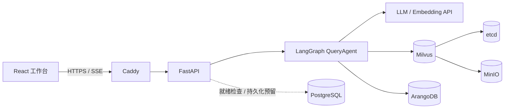

# QueryPilot

> 面向 ArangoDB 的 Schema 感知型自然语言查询 Agent。大模型只生成结构化查询计划，不直接编写或执行 AQL。

[](https://github.com/iisankarea-boop/QueryPilot/actions/workflows/ci.yml)
[](https://www.python.org/)
[](https://github.com/langchain-ai/langgraph)
[](https://milvus.io/)
[](https://arangodb.com/)

在线演示：[https://makeag.art](https://makeag.art)（受 Basic Auth 保护）

QueryPilot 将用户问题转换为受数据库 Schema 约束的 `StructuredQueryPlan`，再由服务端编译器确定性生成只读 AQL。查询执行前还会经过资源白名单、写操作拦截、结果行数限制和 ArangoDB `EXPLAIN` 验证。

```text
自然语言问题
    ↓
Milvus 检索相关 Collection、字段、边和指标
    ↓
LangChain 生成类型化查询计划（不是 AQL）
    ↓
服务端 AqlCompiler 校验 Schema 并编译 AQL
    ↓
安全策略 + ArangoDB EXPLAIN
    ↓
只读账号执行查询
    ↓
SSE 流式返回轨迹、结果和中文总结
```

## 为什么不是直接 Text-to-AQL

让模型直接生成 AQL 很容易出现不存在的字段、错误的边方向、聚合粒度错误和越权写操作。QueryPilot 把模型能力限制在结构化规划阶段，并将 Schema 校验和 AQL 生成交给确定性代码：

- 模型输出由 Pydantic 类型约束，不能返回任意 AQL 字符串。
- 编译器只接受扫描到的 Collection、字段和 Named Graph。
- 无效计划最多修复 4 次，不存在无界 Agent 循环。
- 写关键字、动态 Collection、越权资源和高成本计划在执行前被拒绝。
- ArangoDB 使用专用只读账号，即使上层策略失效也不能写入数据。
- 每次运行都会暴露检索证据、结构化计划、编译后 AQL 和执行结果，便于审计。

## 功能

- **自然语言查询**：支持明细筛选、排序、分组聚合、比率、时间条件和图遍历。
- **任意 ArangoDB 接入**：从前端填写连接信息，自动扫描弱 Schema、采样字段类型并读取 Named Graph。
- **多数据源隔离**：每个 `source_id` 拥有独立连接、Schema、Milvus 目录版本和查询策略。
- **语义目录检索**：使用 Embedding + Milvus 找出与问题相关的字段、边和业务指标。
- **确定性 AQL 编译**：模型生成类型化 IR，服务端负责字段校验、边方向校验和 AQL 渲染。
- **可解释工作流**：前端实时展示 LangGraph 轨迹、召回证据、AQL、预计成本和结果表格。
- **流式响应**：FastAPI 通过 SSE 持续返回每个 Agent 节点的执行事件。
- **生产部署**：提供 Docker Compose、健康检查、资源限制、日志轮转、备份、Caddy HTTPS 和 Basic Auth。

## 技术栈

| 层级 | 技术 | 用途 |
| --- | --- | --- |
| Agent 编排 | LangGraph | 异步状态图、有限修复和节点事件流 |
| 模型接入 | LangChain | 结构化输出、Chat Model 和 Embedding Adapter |
| API | FastAPI + Uvicorn | 异步 HTTP、SSE、数据源接入和健康检查 |
| 查询编译 | Pydantic + 自研编译器 | `StructuredQueryPlan` 校验与确定性 AQL 生成 |
| 图数据库 | ArangoDB | 业务数据、Named Graph 和只读 AQL 执行 |
| 向量数据库 | Milvus Standalone | 多数据源语义目录与向量召回 |
| 基础设施 | PostgreSQL、etcd、MinIO | PostgreSQL 持久化预留、Milvus 元数据与对象存储 |
| 前端 | React + TypeScript + Vite | 查询工作台和 Agent 执行轨迹 |
| 网关 | Caddy | HTTPS、Basic Auth、安全响应头和反向代理 |

项目真实使用 LangChain、LangGraph 和 Milvus，它们不是仅存在于依赖列表中。核心实现可从以下文件开始阅读：

- [`query_agent.py`](apps/api/src/querypilot/application/query_agent.py)：LangGraph 工作流。
- [`aql_compiler.py`](apps/api/src/querypilot/application/aql_compiler.py)：结构化计划到 AQL 的编译器。
- [`safe_aql.py`](apps/api/src/querypilot/application/safe_aql.py)：查询准备、策略检查和执行边界。
- [`schema_discovery.py`](apps/api/src/querypilot/application/schema_discovery.py)：动态数据库 Schema 扫描。
- [`milvus_catalog.py`](apps/api/src/querypilot/adapters/milvus_catalog.py)：语义目录发布与检索。
- [`http.py`](apps/api/src/querypilot/transport/http.py)：FastAPI 和 SSE 接口。

## 系统架构



完整设计与边界说明见 [`TECHNICAL_DESIGN.md`](TECHNICAL_DESIGN.md)，生产部署手册见 [`DEPLOYMENT.md`](DEPLOYMENT.md)。

## 接入远程 ArangoDB

QueryPilot 不要求客户把数据库迁移到 Agent 服务器。连接数据库的是 QueryPilot 后端，因此目标 ArangoDB 只需要能被后端通过 HTTPS、VPN、VPC 或客户侧隧道访问。

在前端点击“接入数据源”，填写：

```text
数据源 ID：sales-prod
数据库：sales
ArangoDB 地址：https://db.example.com:8529
只读用户名：querypilot_reader
密码：只读账号密码
每个集合采样：50
```

接入流程：

```text
连接验证 → 扫描 Collection → 推断字段类型 → 读取 Named Graph
         → 生成 Embedding → 发布 Milvus 目录 → 注册查询 Agent
```

生产环境必须将目标主机加入 `SOURCE_ALLOWED_HOSTS`，防止公开接口被用于 SSRF 和内网探测：

```dotenv
SOURCE_ALLOWED_HOSTS=arangodb,db.example.com
```

建议客户数据库使用 HTTPS 和只读账号，并在防火墙中只允许 QueryPilot 出口 IP。当前动态数据源凭据仅保存在 API 进程内存中，API 重启后需要重新接入；凭据加密持久化和多租户隔离属于后续里程碑。

也可以直接调用接口：

```bash
curl -X POST http://127.0.0.1:8000/api/v1/sources \
  -H "Content-Type: application/json" \
  -d '{
    "source_id": "analytics",
    "url": "https://db.example.com:8529",
    "database": "analytics",
    "username": "querypilot_reader",
    "password": "replace-me",
    "sample_size": 50
  }'
```

## 本地运行

### 环境要求

- Python 3.11+
- Docker Desktop 或 Docker Engine
- Docker Compose v2
- 兼容 OpenAI API 的 Chat Model 和 Embedding 服务

### 1. 配置环境变量

```bash
cp .env.example .env
```

填写 `.env` 中的模型 API Key 和各服务密码。`.env` 已被 Git 忽略，不要将密钥提交到仓库。

### 2. 启动数据服务

```bash
docker compose --env-file .env -f infra/compose.yaml up -d \
  postgres arangodb etcd minio milvus-standalone
```

### 3. 初始化演示数据库

```bash
docker compose --env-file .env -f infra/compose.yaml \
  --profile tools run --rm seed
```

固定种子的 `commerce` 数据集包含 120 个用户、160 个商品、1,200 个订单和 4,360 条图关系。

### 4. 发布 Milvus 语义目录

该步骤会调用 `.env` 中配置的 Embedding API：

```bash
docker compose --env-file .env -f infra/compose.yaml \
  --profile tools run --rm catalog-publish
```

### 5. 启动 API 和前端

```bash
docker compose --env-file .env -f infra/compose.yaml up -d api
```

打开 [http://127.0.0.1:8000](http://127.0.0.1:8000)，或检查服务状态：

```bash
curl http://127.0.0.1:8000/health/live
curl http://127.0.0.1:8000/health/ready
```

发送一条流式查询：

```bash
curl -N -X POST http://127.0.0.1:8000/api/v1/runs:stream \
  -H "Content-Type: application/json" \
  -d '{"source_id":"commerce","question":"销量最高的商品是什么？"}'
```

## 测试与质量门禁

```bash
python -m venv .venv
python -m pip install -e ".[dev,postgres]"
python -m ruff check apps/api/src apps/api/tests infra/scripts evals
python -m mypy apps/api/src/querypilot
python -m pytest
cd apps/web && npm ci && npm run build
```

GitHub Actions 会执行前端构建、后端 lint、严格类型检查、测试、评测用例校验、评测回归门禁和生产 Compose 校验。

## 评测

仓库包含 30 条固定评测，覆盖：

- 明细过滤、排序和 Top-N。
- 聚合、比率和时间范围。
- 图遍历和反向关联。
- 不存在的字段、Collection 和 Graph。
- INSERT、UPDATE、REMOVE、REPLACE、UPSERT 写操作拒绝。
- Prompt Injection 和敏感信息提取。
- 完整 LangGraph 节点轨迹。

当前保留的真实基线为 **0.8517（22/30）**。未通过用例没有从数据集中删除，用于持续衡量聚合意图、精确 Top-N 和拒绝策略的改进。

```bash
python -m evals.runner --validate-only
python -m evals.runner --output evals/reports/current.json
python -m evals.ci_gate \
  --report evals/reports/current.json \
  --baseline evals/baseline.json
```

评测设计、Grounded LLM Judge 和基线晋升规则见 [`evals/README.md`](evals/README.md)。

## 安全边界

- 生产服务器只公开 `22`、`80` 和 `443`，数据库及 API 端口仅存在于 Docker 网络。
- Caddy 提供 HTTPS、Basic Auth、安全响应头和 HTTP 到 HTTPS 跳转。
- 数据源主机必须命中生产白名单。
- 动态数据源密码不会出现在 API 响应和日志中。
- AQL 写关键字在 `EXPLAIN` 和执行前被拒绝。
- 所有候选查询由服务端追加结果限制，并受超时和预计成本上限约束。
- ArangoDB 使用只读账号执行查询。
- `.env`、证书私钥、数据卷和备份均不会进入 Git。

## 当前限制

- 动态接入的数据源和凭据保存在单个 API 进程内存中，重启后需要重新接入。
- 尚未实现用户账号、工作区、多租户隔离和加密凭据持久化。
- PostgreSQL 已部署并纳入就绪检查，但运行历史和 LangGraph Checkpoint 尚未完成持久化接线。
- 限流器为进程内实现，不适合多 API 实例；当前没有引入 Redis 或任务队列。
- Schema 自动发现能识别字段和图关系，但不能自动理解币种、业务指标口径等领域语义。

这些限制会在加入多租户和后台扫描任务时优先处理，而不是通过扩大 Prompt 掩盖。

## 仓库结构

```text
QueryPilot/
├── apps/
│   ├── api/                 # FastAPI、LangGraph、领域模型和 Adapter
│   └── web/                 # React 查询工作台
├── catalog/                 # 默认数据源的版本化语义目录
├── evals/                   # 固定评测、报告和 CI 回归门禁
├── infra/                   # Compose、Caddy、初始化和备份脚本
├── TECHNICAL_DESIGN.md      # 架构设计与里程碑
├── DEPLOYMENT.md            # Ubuntu 生产部署手册
└── README.md
```

## License

当前仓库尚未添加开源许可证。在许可证明确前，代码版权归仓库所有者保留。
